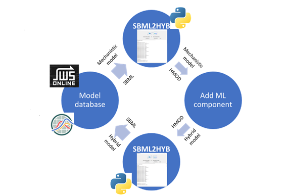
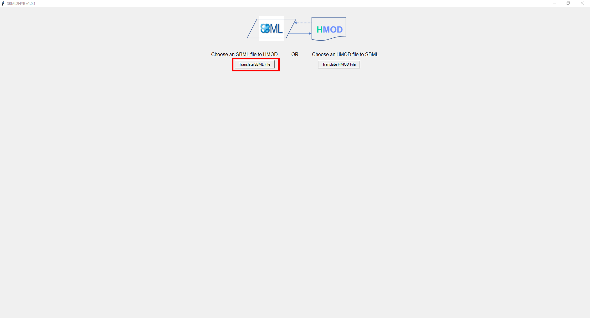
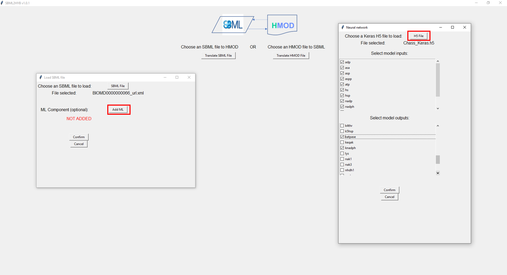
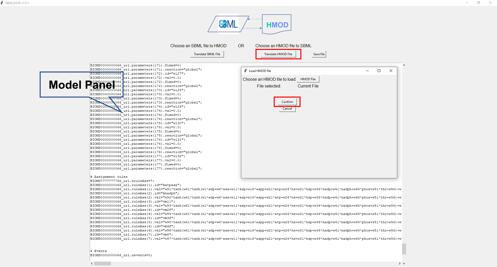
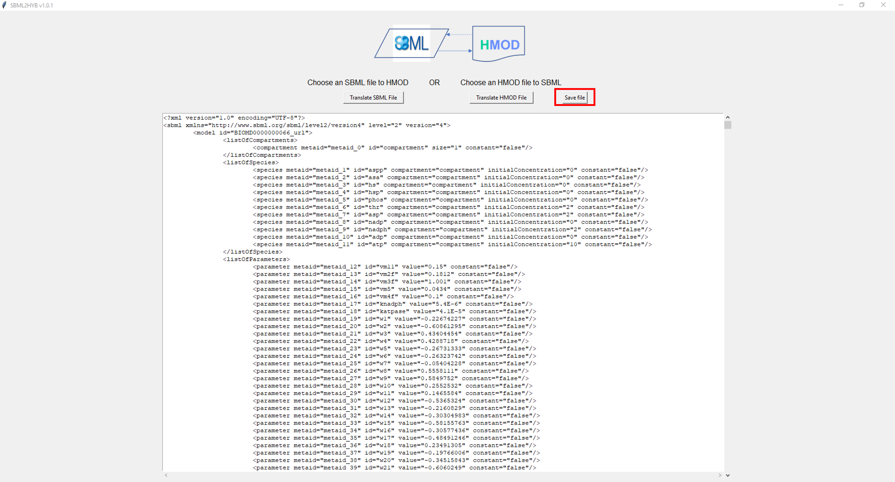

=======================================================
Welcome to the documentation for SBML2HYB
=======================================================

The sbml2hyb tool is an stand-alone executable application for SBML compatible hybrid modelling. The tool is written in Python and is intended as an interface to convert existing `SBML
<http://www.sbml.org>`_ models into a hybrid model (combines mechanistic equations and ML techniques). Below see the proposed pipeline in Figure 1.
The new internal hybrid model format HMOD (intermediate format — enables communication between the essential components of the mechanistic and hybrid models) can be translated to SBML and vice-versa. See `HMOD
<https://github.com/rs-costa/sbml2hyb/blob/main/models/chassagnole1standard.hmod>`_ format example.

   **Figure 1. Overview of the sbml2hyb pipeline.**

Source code available `HERE
<https://github.com/r-costa/sbml2hyb>`_.

--------
Using SBML2HYB
--------
Here is an example of a SBML hybrid model (`Chassagnole 
<https://www.ebi.ac.uk/biomodels/BIOMD0000000066#Overview>`_ case study) built with **sbml2hyb**:

After launching sbml2hyb (see installation instructions), the following graphical user interface (GUI) will be open (Figure 2).
Once the simple GUI window opens, click the "*Translate SBML file*" button (see Figure 2), and browse to specify the SBML model file (here the mechanistic model example is taken from Biomodels database, `BIOMD0000000066
<https://www.ebi.ac.uk/biomodels/model/download/BIOMD0000000066.2?filename=BIOMD0000000066_url.xml>`_) you want to convert.
Add then the information of the neural network component into the model (click "*Add ML*" button). Once you do this, select the "*Inputs*" (select all) and "*Outputs*" (vm5, vm4f, vm3f, vm2f, vm11, knadph and katpase) options, and the `Keras <https://github.com/r-costa/sbml2hyb/blob/main/models/Chass_Keras.h5>`_ neural network file for this case study (Figure 3) to be added to the mechanistic model. After this, click the "*Confirm*" buttons. Finally, the hybrid model generated in HMOD format is reconverted in SBML by clicking the "*Translate HMOD file*" button and then "*Confirm*" button (Figure 4). 
To save the final hybrid SBML model file, click "*Save file*" button (Figure 5). 

**NOTE:** To generate the Keras H5 file that serves as a blueprint of the machine learning segment of the hybrid model, follow these instructions:

1- To generate an H5 file that serves as a blueprint of the machine learning segment of a hybrid model, the Keras library from Tensorflow, Python is used. After importing this library, the first step is to initialize a sequential artificial neural network (ANN) model via the “Sequential” function in the form “model=Sequential()”, where model is a variable containing the model information.

2- This is followed with adding any number of hidden layers with a hyperbolic tangent activation function via the “add” function. This function should be written for each layer in the form:
“model.add(Dense(NH, activation=’tanh’, input_shape(Nprev,)))”, where NH is the number of hidden nodes the user desires in this layer and Nprev is the number of nodes on the previous layer. For the first layer, Nprev must correspond to the number of desired network inputs.

3- After the user is satisfied with the number of hidden layers, the final layer should be written in the form: “model.add(Dense(Nout))”, where Nout is the number of outputs the user wishes the machine learning section to have.

4- With the model finalized, it can the be saved to an H5 file using the “save” function in the form: “model.save(‘filename.h5’)”

See also this example as `notebook <https://github.com/rs-costa/sbml2hyb/blob/main/models/keras_H5/create_keras_h5.ipynb>`_.

   
   **Figure 2. The main GUI of sbml2hyb.**
   

   **Figure 3. Screenshot of the ML component panel. Here, the user can select the input/output variables and the Keras neural network file in H5 format, which is automatically added to the mechanistic model.**

   **Figure 4. Print screen of the hybrid model in HMOD format that can be converted to SBML.**

   **Figure 5. Print screen of the final hybrid model in SBML.**
   
--------
Installation
--------
The sbml2hyb package is available from ``pypi`` and can be installed via::

      $ pip install sbml2hyb
      
For detailed installation instructions please see `https://github.com/r-costa/sbml2hyb
<https://github.com/r-costa/sbml2hyb>`_.

--------
How to cite SBML2HYB
--------

.. image:: https://zenodo.org/badge/DOI/10.5281/zenodo.7293206.svg
   :alt: Zenodo DOI
 
--------
License
--------

SBML2HYB is distributed under the  `GNU Public License (version 3.0)
<https://www.gnu.org/licenses/gpl-3.0.html>`_.
